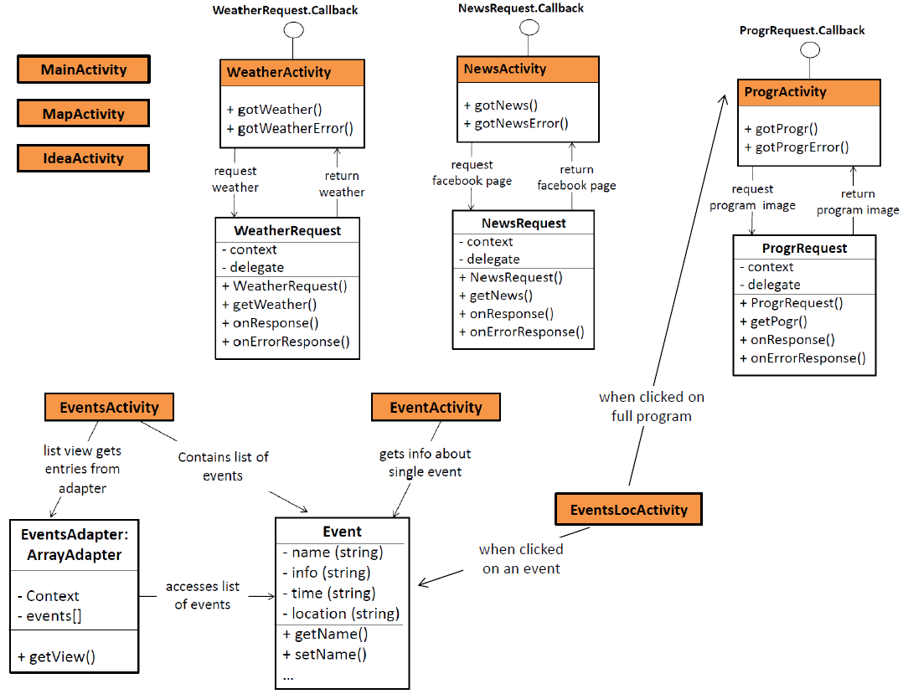

# Design
### Geavanceerde schetsen
De schetsen zijn te vinden het [pdf documentje](Advanced_sketches.pdf). De deeldiagrammen van de modules, classes en functions zijn ook daarin te vinden.

### Diagram --> ook home act

### APIs
- Weer API: http://weerlive.nl/delen.php
Je kunt een gratis API Key aanvragen, maar je moet Weerlive.nl duidelijke credits geven. De locatie kan meegeven worden (coördinaten in mijn geval: 51.4487992,5.962511899999981). Output is een json met o.a. de gemiddelde temperatuur, een afbeelding, voorspelling van vandaag en van morgen. De afbeeldingen dienen wel apart gedownload te worden. 
- Facebook API of webviewer --> waarschijnlijk ga ik de webviewer gebruiken, omdat je toestemming nodig lijkt te hebben voor de API. 

### Data
De data komt van www.bollywoodweekender.nl. Hier staat het programma en informatie over de verschillende artiesten/workshops.
Data wordt met de hand gefilterd en op de juiste manier ingeladen in de app.

### Database
Voor de activiteiten (workshops, optredens) wordt een array adapter gebruikt.
