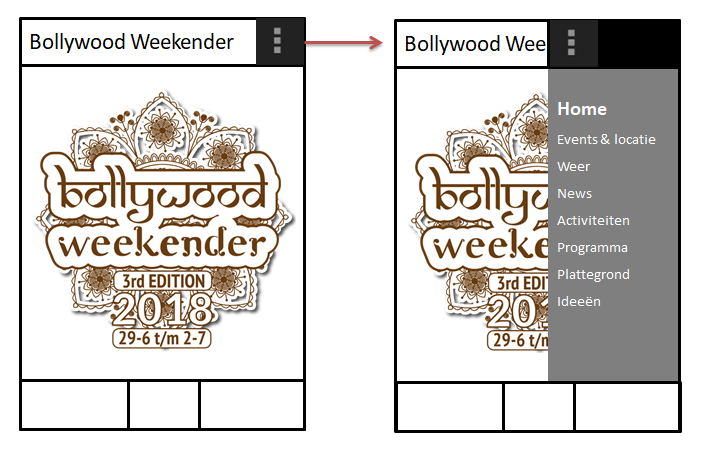
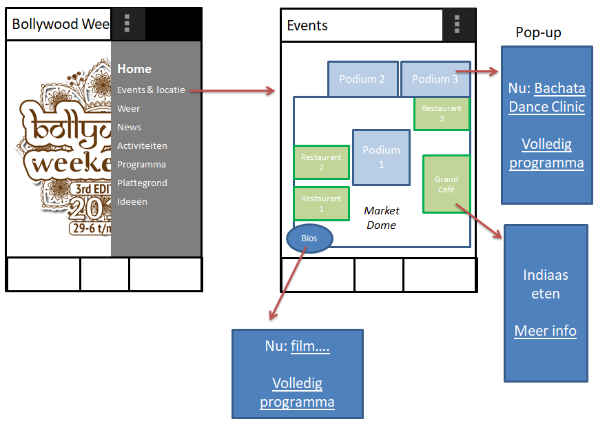
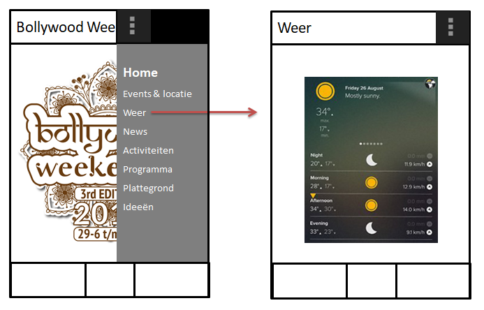
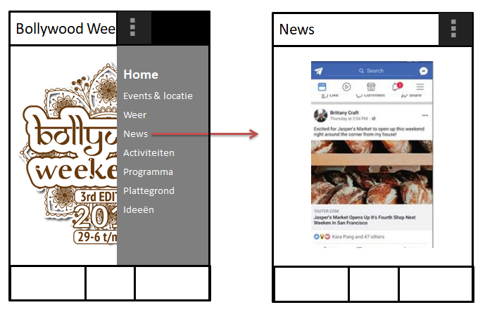
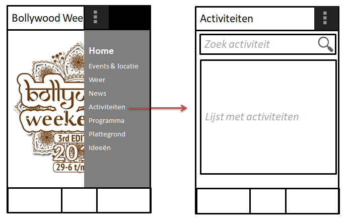
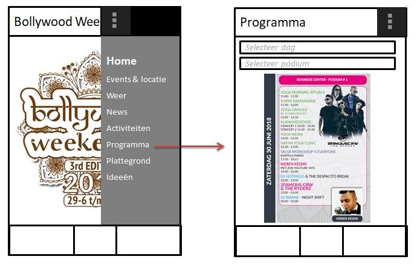
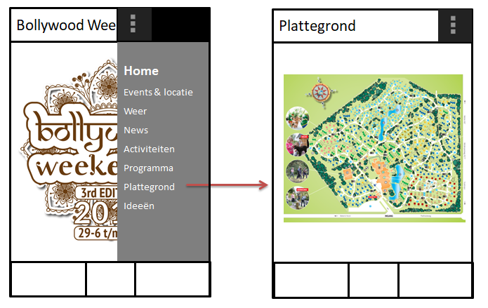
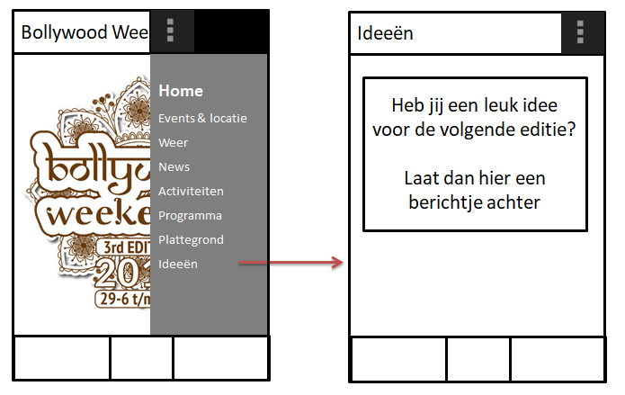

#  Bollywood Weekender App
Programmeerproject | Puja Chandrikasingh | 11059842

 De Bollywood Weekender app is speciaal gemaakt voor iedereen die naar het evenement gaat. Tijdens het evenement draaien er drie podia simultaan met optredens van artiesten en DJ's en natuurlijk heel veel workshops en wedstrijden. In de app worden deze gegevens per locatie weergeven op een interactieve plattegrond. Daarnaast worden ook de laatste updates weergeven. Verder kan er ook gezocht worden op activiteiten. En natuurlijk kan het weer in Limburg (locatie van het evenement) bekeken worden. Ook kunnen de bezoekers ideeën voor de volgende edities gemakkelijk doorgeven. Kortom, alles wat de bezoekers nodig hebben, kunnen ze vinden in deze app!

##
### Probleem
De bezoekers van het evenement hebben veel informatie nodig, bijvoorbeeld wanneer en waar een activiteit zal plaatsvinden. Deze informatie is makkelijk te vinden in de app. Ook moeten ze weten waar hun cottage is en waar de feest locaties zijn. Ook dit is in de app te vinden. Daarnaast moeten ze natuurlijk inpakken en de dagen zelf nog beslissen wat ze aantrekken, dus ook het weer in Limburg kan niet ontbreken. Kortom, alles wat een bezoeker nodig heeft, kan hij/zij vinden in de Bollywood Weekender App.

### De app
Hieronder zijn de schetsen voor de verschillende pagina's van de app weergeven.

Informatie bij Events pagina: klik op meer informatie --> nieuw scherm opent/klik op volledig programma --> doorverwijzen naar programma pagina. 

MVP:
- Home pagina
- Events pagina
- Weer pagina
- News pagina
- Activiteiten pagina, maar niet de zoek functie

De overige pagina's en functies zijn optioneel. Een extra functie bij Events: klik op band naam/workshop naam en krijg uitleg erbij. Ook een afbeelding bij de naam in de pop-up is een leuke toevoeging.

### Data
De gegevens kunnen gevonden worden op www.bollywoodweekender.nl. De data moet nog in de juiste format gezet worden. Voor de News en Weer pagina moeten API's worden gebruikt.

### Externe componenten
De API's en waarschijnlijk een database voor de Events pagina.

### Soort gelijke apps
Bijvoorbeeld de Center Parcs app. Zij hebben ook een plattegrond en een activiteiten lijst. Maar pagina's zoals Events en Ideeën ontbreken. Wel gebruikers reserveren, maar dat is in dit geval niet nodig.

### Obstakels
Voor de Events pagina is lastig te implementeren. Ook de design van de pagina wordt een uitdaging.
