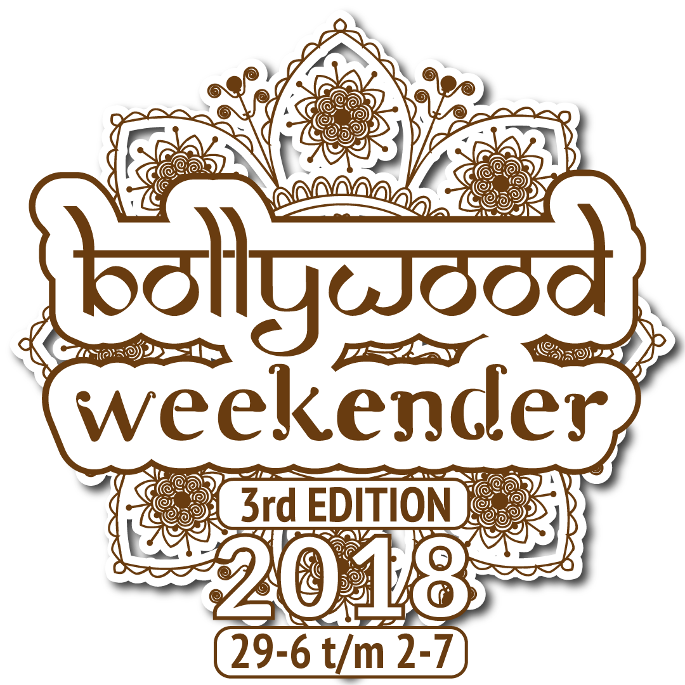

#  Bollywood Weekender
Programmeerproject | Puja Chandrikasingh | 11059842

 De Bollywood Weekender app is speciaal gemaakt voor iedereen die naar het evenement gaat. Tijdens het evenement draaien er drie podia simultaan met optredens van artiesten en DJ's en natuurlijk heel veel workshops en wedstrijden. In de app worden deze gegevens per locatie weergeven op een interactieve plattegrond. Daarnaast worden ook de laatste updates weergeven. Verder kan er ook gezocht worden op activiteiten. En natuurlijk kan het weer in Limburg (locatie van het evenement) bekeken worden. Ook kunnen de bezoekers ideeën voor de volgende edities gemakkelijk doorgeven. Kortom, alles wat de bezoekers nodig hebben, kunnen ze vinden in deze app!

### Screen shots

### Data
De gegevens kunnen gevonden worden op www.bollywoodweekender.nl.

### Externe componenten
- voor het weer wordt de API van Weerlive.nl gebruikt (afbeeldingen en voorspellingen)
- voor het inzomen van afbeeldingen wordt geberuik gemaakt van: https://github.com/chrisbanes/PhotoView
- afbeeldingen van artiesten en het logo zijn afkomstig van www.bollywoodweekender.nl

