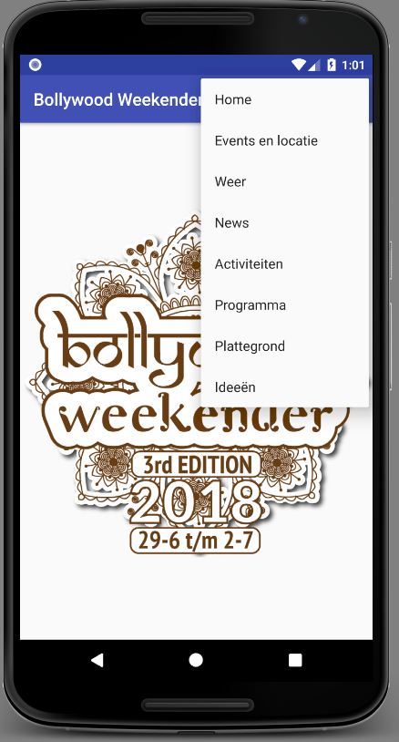
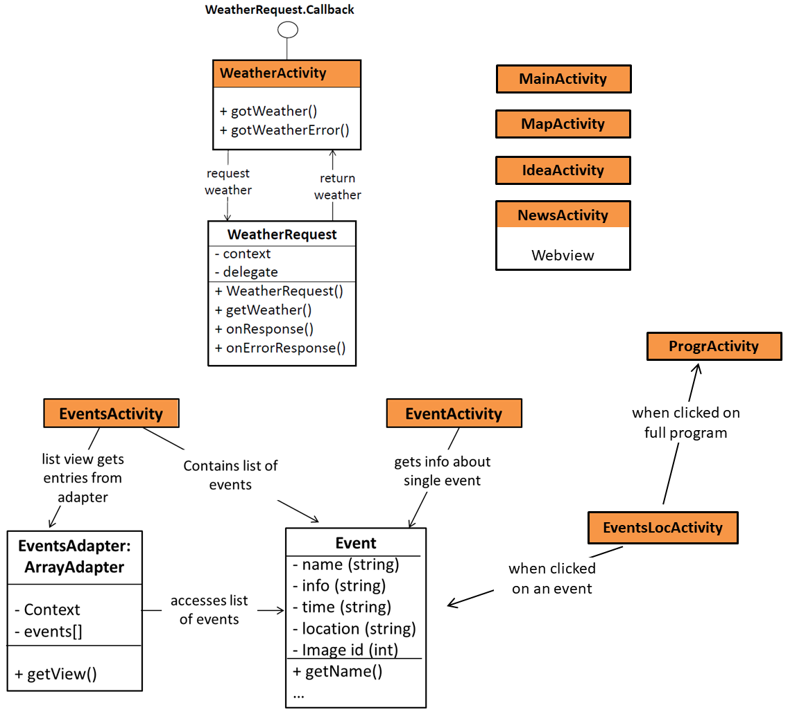

# Eind verslag
De Bollywood Weekender app is speciaal gemaakt voor iedereen die naar het evenement gaat. Op de foto hieronder is te zien welke pagina's de app omvat. De app maakt het vooral makkelijk om op elk moment te kijken welk optreden/show waar plaatsvindt.

 

### Technisch design
De app omvat de volgende pagina's: Home, Events en locatie, Weer, News, Activiteiten, Programma, Plattegrond, Ideeën.

Allereerst de alleen staande pagina's: 
- Home bevat alleen een foto 
- Weer laat de temperatuursverwachting voor vandaag, morgen en overmorgen zien
- News laat de facebook pagina van Bollywood Weekender in (via een webview)
- Programma laat een gebruiker via een drop down kiezen van welke dag hij of zij het programma (als plaatje) wil bekijken
- Plattegrond bevat een inzoombare plattegrond van het gehele park zodat gebruikers hun cottage kunnen zoeken
- Ideeën laat een gebruiker gemakkelijk zijn of haar ideeën mailen naar de organisatie

De Acitiviteiten pagina bevat een grid view met activiteiten. Via een drop down menu kan een gebruiker kiezen voor welke dag hij of zij de activiteiten wil zien. Als een gebruiker op een event klikt, opent een nieuwe pagina (Event) met meer informatie over dit event.

De Events en locatie pagina bevat een interactive plattegrond van de event locaties. Als een gebruiker op een locatie klikt, verschijnt er een pop-up met welk event er op dit moment bezig is. Een gebruiker kan vervolgens de pop-up sluiten, doorgaan naar meer informatie over het event of het gehele programma bekijken. Er is dus een koppeling tussen 'Events en locatie' en Programma en Event (een pagina die alleen via 'Events en locatie' en Activiteiten te bereiken is).

### Moeilijkheden
- Het maken van de 'Events en locatie' pagina was het lastigst. Veel tijd is gaan zitten in het krijgen van de juiste layout (veel verschillende versies heb ik moeten uitwerken voordat ik een overzichtelijke versie had). 
- Het inladen van de data was lastig. Na overleg heb ik gekozen voor mijn huidige datastructuur. Aan het einde kwam ik er echter achter dat een andere data structuur wellicht handiger was geweest voor het vergelijken van verschillende events (locatie en tijd) voor de 'Events en locatie' pagina.
- Het rekenen met Date objecten was lastig, vooral omdat ik alles per dag wil vergelijken maar het vrijdag en zaterdag gaat het programma door tot in de ochtend van de volgende dag, dus dit ging eerst mis. Nu werkt alles!

Uiteindelijk heb ik geen grote veranderingen doorgevoerd t.o.v. mijn DESIGN document. Alleen bij Programma hoef ik geen request te doen, omdat ik simpelweg plaatjes inlaad. Verder is bij de class Event een extra property toegevoegd (id van de afbeelding), want ik wilde graag een afbeelding kunnen laten zien bij een event.

Indien ik meer tijd zou hebben, zou ik de Home pagina uitbreiden. Het is echter even zoeken naar wat de beste Home pagina zou zijn, omdat ik zelf niet zeker weet wat handig zou zijn op de Home pagina. Verder zou ik willen dat mensen kunnen inloggen en activiteiten kunnen opslaan, zodat ze meldingen kunnen krijgen wanneer iets bijna begint. Ook zou ik de layout van de weer pagina willen verbeteren. Ik zou hier andere plaatjes kunnen zoeken of een andere API kunnen gebruiken.
